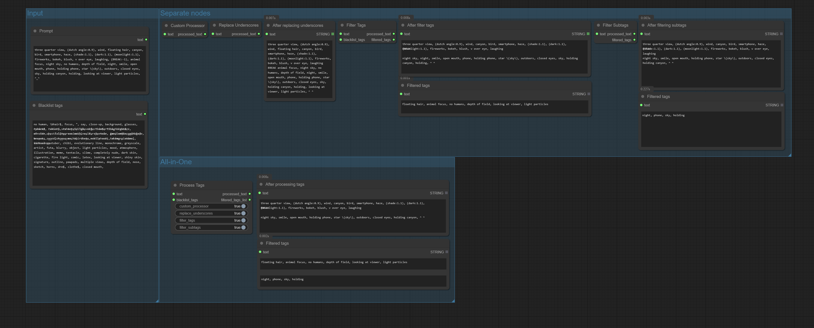

# ComfyUI-Alchemine-Pack


ComfyUI-Alchemine-Pack is a custom node pack for [ComfyUI](https://github.com/comfyanonymous/ComfyUI).
It provides nodes to assist with various workflow tasks, such as prompt processing.

## Provided Nodes

### ProcessTags
- **Description:**
  - Refines tags in prompts, removes tags based on a blacklist (with wildcard support), removes subtags, replaces underscores, and offers various normalization options.
  - Multiple refinement options can be applied at once, and a custom processor can be enabled.
- **Category:** `AlcheminePack/Prompt`
- **Inputs:**
  - `text` (string): Input prompt text
  - `blacklist_tags` (string): Comma-separated list of tags to remove (supports wildcards)
  - `custom_processor` (boolean): Apply custom prompt normalization (default: True)
  - `replace_underscores` (boolean): Replace underscores with spaces (default: True)
  - `filter_tags` (boolean): Remove blacklisted tags (default: True)
  - `filter_subtags` (boolean): Remove duplicate/unnecessary subtags (default: True)
- **Outputs:**
  - `processed_text` (refined string)
  - `filtered_tags_list` (list of removed tags, grouped by operation)
- **Example:**
  - Input: `dog, cat, white dog, black cat`, blacklist_tags: `cat`, filter_tags: True, filter_subtags: True, replace_underscores: False
  - Output: `white dog, black cat`, removed tags: `[cat]`

### FilterTags
- **Description:**
  - Removes tags from prompts that match the blacklist. Recognizes tags with various bracket/weight notations. Supports wildcards (see below).
- **Category:** `AlcheminePack/Prompt`
- **Inputs:**
  - `text` (string)
  - `blacklist_tags` (string, comma-separated, supports wildcards)
- **Outputs:**
  - `processed_text` (refined string)
  - `filtered_tags` (comma-separated list of removed tags)
- **Example:**
  - Input: `dog, cat, white dog, black cat`, blacklist_tags: `cat`
  - Output: `dog, white dog, black cat`, removed tags: `cat`

### FilterSubtags
- **Description:**
  - Removes duplicate or unnecessary subtags in prompts and normalizes various bracket/nesting/weight notations.
- **Category:** `AlcheminePack/Prompt`
- **Input:** `text` (string)
- **Outputs:**
  - `processed_text` (refined string)
  - `filtered_tags` (comma-separated list of removed subtags)
- **Example:**
  - Input: `dog, cat, white dog, black cat`
  - Output: `white dog, black cat`
  - Input: `(cat:0.9), (cat:1.1), black cat, (black cat)`
  - Output: `(cat:0.9), (cat:1.1), black cat, (black cat)`

### ReplaceUnderscores
- **Description:**
  - Converts all underscores (_) in the prompt to spaces.
- **Category:** `AlcheminePack/Prompt`
- **Input:** `text` (string)
- **Output:**
  - `processed_text` (string with underscores replaced by spaces)
- **Example:**
  - Input: `dog_cat_white_dog_black_cat`
  - Output: `dog cat white dog black cat`

### CustomProcessor
- **Description:**
  - Custom processor for prompt text. Removes weights from BREAK tokens and normalizes prompt structure.
- **Category:** `AlcheminePack/Prompt`
- **Input:** `text` (string)
- **Output:**
  - `processed_text` (custom-processed string)
- **Example:**
  - Input: `tag, (BREAK:-1), tags`
  - Output: `tag BREAK tags`

## Wildcard Support

- The blacklist in `FilterTags` and `ProcessTags` supports wildcards defined in `resources/wildcards.yaml`.
- Example: Using `__color__` in the blacklist will match any color defined in the YAML file (e.g., `red`, `blue`, `green`, etc.).

## Installation & Usage

1. Copy or clone this repository into the `custom_nodes` directory of your ComfyUI installation.
2. Restart ComfyUI. You will then be able to use each node from the `AlcheminePack/Prompt` category in your workflow.

## Examples

Below are usage examples for each node.

```
[ProcessTags]
Input: dog, cat, white dog, black cat (blacklist_tags: cat)
Output: white dog, black cat (removed tags: [cat])

[FilterTags]
Input: dog, cat, white dog, black cat (blacklist_tags: cat)
Output: dog, white dog, black cat (removed tags: cat)

[FilterSubtags]
Input: dog, cat, white dog, black cat
Output: white dog, black cat

Input: (cat:0.9), (cat:1.1), black cat, (black cat)
Output: (cat:0.9), (cat:1.1), black cat, (black cat)

[ReplaceUnderscores]
Input: dog_cat_white_dog_black_cat
Output: dog cat white dog black cat

[CustomProcessor]
Input: tag, (BREAK:-1), tags
Output: tag BREAK tags
```

---

# ComfyUI-Alchemine-Pack


ComfyUI-Alchemine-Pack은 [ComfyUI](https://github.com/comfyanonymous/ComfyUI)를 위한 커스텀 노드 팩입니다.
프롬프트 처리 등 다양한 워크플로우를 보조하는 노드를 제공합니다.

## 제공 노드

### ProcessTags
- **설명:**
  - 프롬프트에서 태그를 정제하고, 블랙리스트 기반 태그 제거(와일드카드 지원), 서브태그 제거, 언더스코어 제거 등 다양한 정규화 옵션을 제공합니다.
  - 여러 정제 옵션을 한 번에 적용할 수 있으며, 커스텀 프로세서를 활성화할 수 있습니다.
- **카테고리:** `AlcheminePack/Prompt`
- **입력:**
  - `text` (문자열): 입력 프롬프트 텍스트
  - `blacklist_tags` (문자열): 제거할 태그 목록(쉼표 구분, 와일드카드 지원)
  - `custom_processor` (boolean): 커스텀 프롬프트 정규화 적용 (기본값: True)
  - `replace_underscores` (boolean): 언더스코어를 공백으로 변환 (기본값: True)
  - `filter_tags` (boolean): 블랙리스트 태그 제거 (기본값: True)
  - `filter_subtags` (boolean): 중복/불필요 서브태그 제거 (기본값: True)
- **출력:**
  - `processed_text` (정제된 문자열)
  - `filtered_tags_list` (작업별로 제거된 태그 목록)
- **예시:**
  - 입력: `dog, cat, white dog, black cat`, blacklist_tags: `cat`, filter_tags: True, filter_subtags: True, replace_underscores: False
  - 출력: `white dog, black cat`, 제거된 태그: `[cat]`

### FilterTags
- **설명:**
  - 프롬프트에서 블랙리스트에 해당하는 태그를 제거합니다. 다양한 괄호/가중치 표기법을 정규화하여 태그를 인식합니다. 와일드카드 지원(아래 참고).
- **카테고리:** `AlcheminePack/Prompt`
- **입력:**
  - `text` (문자열)
  - `blacklist_tags` (문자열, 쉼표 구분, 와일드카드 지원)
- **출력:**
  - `processed_text` (정제된 문자열)
  - `filtered_tags` (제거된 태그 목록, 쉼표 구분)
- **예시:**
  - 입력: `dog, cat, white dog, black cat`, blacklist_tags: `cat`
  - 출력: `dog, white dog, black cat`, 제거된 태그: `cat`

### FilterSubtags
- **설명:**
  - 프롬프트 내에서 중복되거나 불필요한 서브태그를 제거하고, 다양한 괄호/중첩/가중치 표기법을 정규화합니다.
- **카테고리:** `AlcheminePack/Prompt`
- **입력:** `text` (문자열)
- **출력:**
  - `processed_text` (정제된 문자열)
  - `filtered_tags` (제거된 서브태그 목록, 쉼표 구분)
- **예시:**
  - 입력: `dog, cat, white dog, black cat`
  - 출력: `white dog, black cat`
  - 입력: `(cat:0.9), (cat:1.1), black cat, (black cat)`
  - 출력: `(cat:0.9), (cat:1.1), black cat, (black cat)`

### ReplaceUnderscores
- **설명:**
  - 프롬프트 내 모든 언더스코어(_)를 공백으로 변환합니다.
- **카테고리:** `AlcheminePack/Prompt`
- **입력:** `text` (문자열)
- **출력:**
  - `processed_text` (언더스코어가 공백으로 변환된 문자열)
- **예시:**
  - 입력: `dog_cat_white_dog_black_cat`
  - 출력: `dog cat white dog black cat`

### CustomProcessor
- **설명:**
  - 프롬프트 텍스트를 커스텀 정제합니다. BREAK 토큰의 가중치를 제거하고 프롬프트 구조를 정규화합니다.
- **카테고리:** `AlcheminePack/Prompt`
- **입력:** `text` (문자열)
- **출력:**
  - `processed_text` (커스텀 정제된 문자열)
- **예시:**
  - 입력: `tag, (BREAK:-1), tags`
  - 출력: `tag BREAK tags`

## 와일드카드 지원

- `FilterTags`와 `ProcessTags`의 블랙리스트는 `resources/wildcards.yaml`에 정의된 와일드카드를 지원합니다.
- 예시: 블랙리스트에 `__color__`를 사용하면 YAML 파일에 정의된 모든 색상(`red`, `blue`, `green` 등)에 매칭됩니다.

## 설치 및 사용법

1. 이 저장소를 ComfyUI의 `custom_nodes` 디렉터리에 복사 또는 클론합니다.
2. ComfyUI를 재시작하면, 워크플로우 내에서 `AlcheminePack/Prompt` 카테고리에서 각 노드를 사용할 수 있습니다.

## 예시

아래는 각 노드의 사용 예시입니다.

```
[ProcessTags]
입력: dog, cat, white dog, black cat (blacklist_tags: cat)
출력: white dog, black cat (제거된 태그: [cat])

[FilterTags]
입력: dog, cat, white dog, black cat (blacklist_tags: cat)
출력: dog, white dog, black cat (제거된 태그: cat)

[FilterSubtags]
입력: dog, cat, white dog, black cat
출력: white dog, black cat

입력: (cat:0.9), (cat:1.1), black cat, (black cat)
출력: (cat:0.9), (cat:1.1), black cat, (black cat)

[ReplaceUnderscores]
입력: dog_cat_white_dog_black_cat
출력: dog cat white dog black cat

[CustomProcessor]
입력: tag, (BREAK:-1), tags
출력: tag BREAK tags
```
