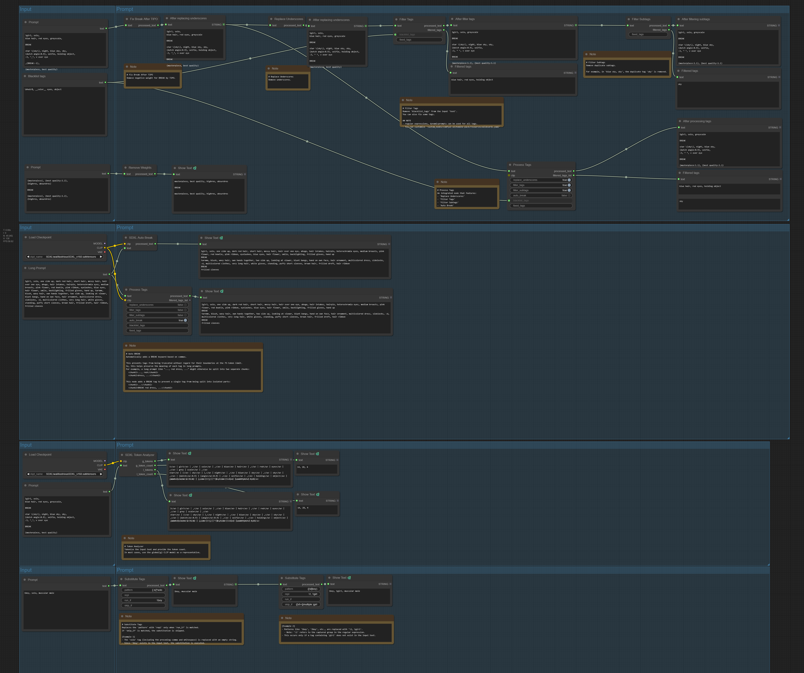
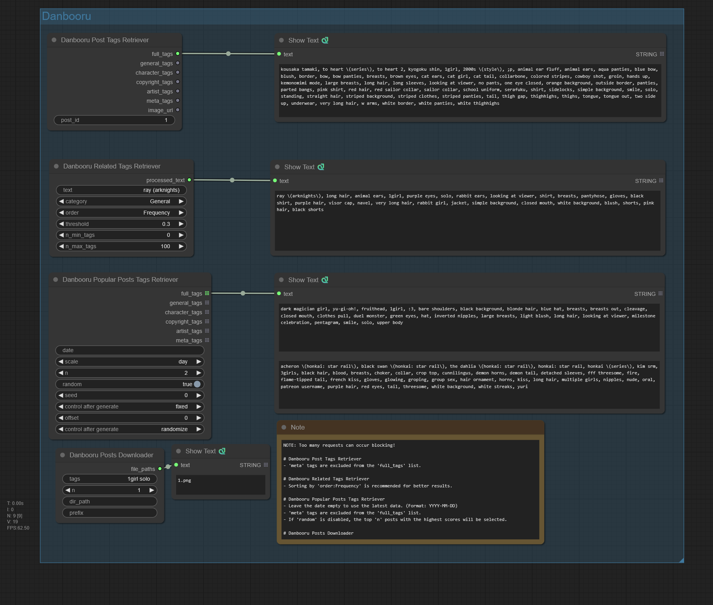
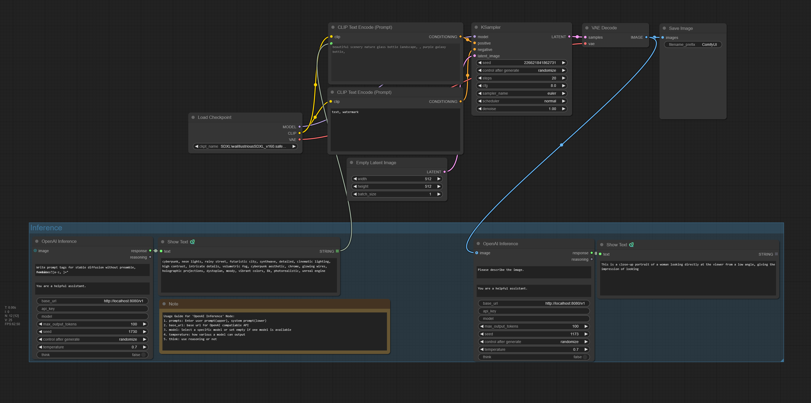
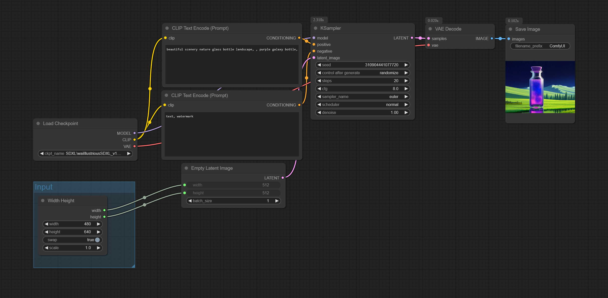
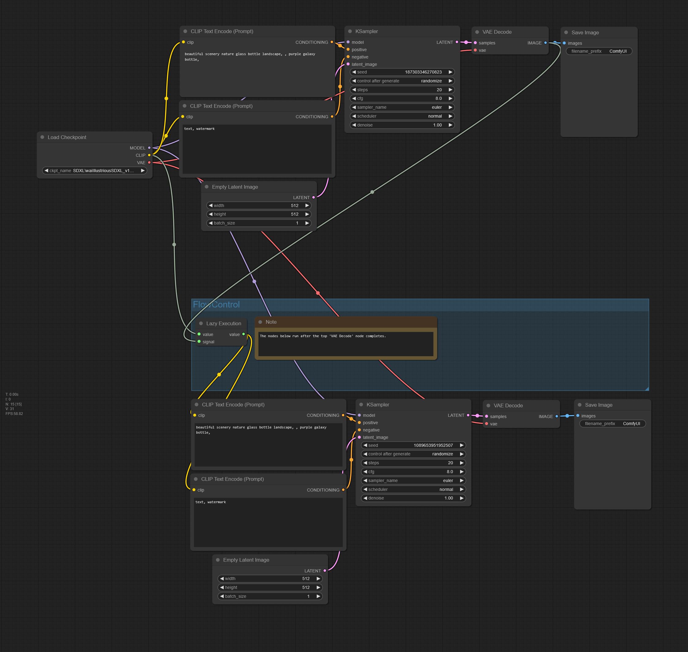

# ComfyUI-Alchemine-Pack

A custom node pack for [ComfyUI](https://github.com/comfyanonymous/ComfyUI) that provides utility nodes for prompt processing, Danbooru integration, LLM inference, and workflow control.

## Installation

1. Clone or copy this repository into the `custom_nodes` directory of your ComfyUI installation.
2. Install dependencies:
   ```bash
   pip install -r requirements.txt
   ```
3. (Optional) For Danbooru nodes, install Playwright browsers:
   ```bash
   playwright install
   ```
4. Restart ComfyUI.

## Provided Nodes

### Prompt Nodes (`AlcheminePack/Prompt`)



| Node | Description |
|------|-------------|
| **ProcessTags** | Full pipeline for tag processing. Combines ReplaceUnderscores → FilterTags → FilterSubtags → SDXLAutoBreak in sequence. |
| **FilterTags** | Removes blacklisted tags from prompts. Supports wildcards defined in `resources/wildcards.yaml`. |
| **FilterSubtags** | Removes duplicate/unnecessary subtags (e.g., `dog, white dog` → `white dog`). |
| **ReplaceUnderscores** | Converts all underscores (`_`) to spaces. |
| **FixBreakAfterTIPO** | Fixes BREAK token formatting after TIPO output (removes weights like `(BREAK:-1)`). |
| **SDXLTokenAnalyzer** | Analyzes CLIP tokens in a prompt (SDXL only). Returns g/l tokenizer results with token counts. |
| **RemoveWeights** | Removes all weight notations from tags (e.g., `(cat:1.2)` → `cat`). |
| **SDXLAutoBreak** | Automatically inserts BREAK to keep each segment within 75 tokens (SDXL only). |
| **SubstituteTags** | Regex-based tag substitution with conditional execution (`run_if`, `skip_if`). |
| **SeparateLoraTags** | Separates lora tags (`<lora:...>`) from a prompt. If the same lora appears multiple times, the last weight is used. |

#### ProcessTags

| Parameter | Type | Default | Description |
|-----------|------|---------|-------------|
| `text` | STRING | (required) | Input prompt text |
| `replace_underscores` | BOOLEAN | True | Replace underscores with spaces |
| `filter_tags` | BOOLEAN | True | Remove blacklisted tags |
| `filter_subtags` | BOOLEAN | True | Remove duplicate/unnecessary subtags |
| `auto_break` | BOOLEAN | False | Auto-insert BREAK for 75-token limit |
| `clip` | CLIP | (optional) | Required for `auto_break` |
| `blacklist_tags` | STRING | "" | Comma-separated blacklist (supports wildcards) |
| `fixed_tags` | STRING | "" | Tags to preserve regardless of filtering |

#### FilterTags

| Parameter | Type | Default | Description |
|-----------|------|---------|-------------|
| `text` | STRING | (required) | Input prompt text |
| `blacklist_tags` | STRING | "" | Comma-separated blacklist (supports wildcards) |
| `fixed_tags` | STRING | "" | Tags to preserve regardless of filtering |

#### FilterSubtags

| Parameter | Type | Default | Description |
|-----------|------|---------|-------------|
| `text` | STRING | (required) | Input prompt text |
| `fixed_tags` | STRING | "" | Tags to preserve regardless of subtag filtering |

#### SDXLTokenAnalyzer

| Parameter | Type | Default | Description |
|-----------|------|---------|-------------|
| `clip` | CLIP | (required) | CLIP model (must expose `clip_g` / `clip_l`) |
| `text` | STRING | (required) | Input prompt text |

| Output | Description |
|--------|-------------|
| `g_tokens` | Tokens decoded by `clip_g` (segments separated by BREAK) |
| `g_token_count` | Per-segment `clip_g` token counts, comma-separated |
| `l_tokens` | Tokens decoded by `clip_l` |
| `l_token_count` | Per-segment `clip_l` token counts, comma-separated |

#### SDXLAutoBreak

| Parameter | Type | Default | Description |
|-----------|------|---------|-------------|
| `clip` | CLIP | (required) | CLIP model (uses `clip_g` token count) |
| `text` | STRING | (required) | Input prompt text |

#### ReplaceUnderscores / FixBreakAfterTIPO / RemoveWeights

| Parameter | Type | Default | Description |
|-----------|------|---------|-------------|
| `text` | STRING | (required) | Input prompt text |

#### SubstituteTags

| Parameter | Type | Default | Description |
|-----------|------|---------|-------------|
| `text` | STRING | (required) | Input prompt text |
| `pattern` | STRING | "" | Regex pattern to match |
| `repl` | STRING | "" | Replacement string |
| `run_if` | STRING | "" | Only run if this pattern exists |
| `skip_if` | STRING | "" | Skip if this pattern exists |

#### SeparateLoraTags

| Parameter | Type | Default | Description |
|-----------|------|---------|-------------|
| `text` | STRING | (required) | Input prompt text |

| Output | Description |
|--------|-------------|
| `text_without_lora` | Text with all lora tags removed (whitespace/newlines preserved as much as possible) |
| `text_with_lora` | Deduplicated lora tags joined by spaces (when the same lora appears multiple times, the last weight wins) |

---

### Danbooru Nodes (`AlcheminePack/Danbooru`) *(Disabled by default)*

> ℹ️ The Danbooru nodes are present in the source tree but currently **not registered** in `__init__.py`. To enable them, uncomment the relevant imports and entries in `__init__.py`, then run `playwright install`.




| Node | Description |
|------|-------------|
| **Danbooru Post Tags Retriever** | Retrieves tags from a specific Danbooru post by post ID. |
| **Danbooru Related Tags Retriever** | Finds related tags by frequency/similarity from Danbooru. |
| **Danbooru Popular Posts Tags Retriever** | Gets tags from popular posts (daily/weekly/monthly). |
| **Danbooru Posts Downloader** | Downloads images from Danbooru based on search tags. |

> ⚠️ **Note:** Too many requests can result in blocking. Use caching and rate limiting.

#### Danbooru Post Tags Retriever

| Parameter | Type | Description |
|-----------|------|-------------|
| `post_id` | STRING | Danbooru post ID |

| Output | Description |
|--------|-------------|
| `full_tags` | All tags (character + copyright + artist + general, excludes meta) |
| `general_tags` | General tags only |
| `character_tags` | Character tags only |
| `copyright_tags` | Copyright tags only |
| `artist_tags` | Artist tags only |
| `meta_tags` | Meta tags only |
| `image_url` | Image URL |

#### Danbooru Related Tags Retriever

| Parameter | Type | Default | Description |
|-----------|------|---------|-------------|
| `text` | STRING | (required) | Input tag(s) |
| `category` | ENUM | "General" | Tag category filter (General/Character/Copyright/Artist/Meta) |
| `order` | ENUM | "Frequency" | Sort order (Cosine/Jaccard/Overlap/Frequency) |
| `threshold` | FLOAT | 0.3 | Minimum similarity threshold |
| `n_min_tags` | INT | 0 | Minimum number of tags to return |
| `n_max_tags` | INT | 100 | Maximum number of tags to return |

#### Danbooru Popular Posts Tags Retriever

| Parameter | Type | Default | Description |
|-----------|------|---------|-------------|
| `date` | STRING | "" | Date (YYYY-MM-DD format, empty for latest) |
| `scale` | ENUM | "day" | Time scale (day/week/month) |
| `n` | INT | 1 | Number of posts to retrieve |
| `random` | BOOLEAN | True | Random selection |
| `seed` | INT | 0 | Random seed |

#### Danbooru Posts Downloader

| Parameter | Type | Default | Description |
|-----------|------|---------|-------------|
| `tags` | STRING | "" | Search tags |
| `n` | INT | 1 | Number of images to download |
| `dir_path` | STRING | "" | Output directory (relative to ComfyUI output folder) |
| `prefix` | STRING | "" | Filename prefix |

---

### Inference Nodes (`AlcheminePack/Inference`) *(Disabled by default)*

> ℹ️ The Inference nodes are present in the source tree but currently **not registered** in `__init__.py`. To enable them, uncomment the relevant imports and entries in `__init__.py`.




| Node | Description |
|------|-------------|
| **Gemini Inference** | Generate text using Google Gemini API. Supports vision and thinking mode. |
| **Ollama Inference** | Generate text using local Ollama API. Supports vision models. |
| **Text Editing Inference** | Grammar correction and text editing using CoEdit model. |

#### Gemini Inference

| Parameter | Type | Default | Description |
|-----------|------|---------|-------------|
| `system_instruction` | STRING | "You are a helpful assistant." | System prompt |
| `prompt` | STRING | "Hello, world!" | User prompt |
| `gemini_api_key` | STRING | "" | API key (or set in `config.json`) |
| `model` | STRING | "latest" | Model name (`latest`, `latest-flash-lite`, `latest-pro-preview`, etc.) |
| `max_output_tokens` | INT | 100 | Maximum output tokens |
| `seed` | INT | 0 | Random seed |
| `think` | BOOLEAN | False | Enable thinking mode |
| `candidate_count` | INT | 1 | Number of candidates (1-8) |
| `image` | IMAGE | (optional) | Input image for vision tasks |

#### Ollama Inference

| Parameter | Type | Default | Description |
|-----------|------|---------|-------------|
| `system_instruction` | STRING | "You are a helpful assistant." | System prompt |
| `prompt` | STRING | "Hello, world!" | User prompt |
| `ollama_url` | STRING | "" | Ollama API URL (or set in `config.json`) |
| `model` | STRING | "" | Model name (must be available in Ollama) |
| `max_output_tokens` | INT | 100 | Maximum output tokens |
| `seed` | INT | 0 | Random seed |
| `think` | BOOLEAN | False | Enable thinking mode |
| `image` | IMAGE | (optional) | Input image for vision tasks |

#### Text Editing Inference

| Parameter | Type | Default | Description |
|-----------|------|---------|-------------|
| `predefined_system_instruction` | ENUM | "Fix the grammar" | Predefined instruction |
| `system_instruction` | STRING | "" | Custom instruction (overrides predefined if set) |
| `prompt` | STRING | (example text) | Input text to edit |
| `seed` | INT | 0 | Random seed |

Available predefined instructions:
- Fix the grammar
- Make this text coherent
- Rewrite to make this easier to understand
- Paraphrase this
- Write this more formally
- Write in a more neutral way

---

### Input Nodes (`AlcheminePack/Input`)



| Node | Description |
|------|-------------|
| **Width Height** | Configurable width/height with swap and scale options. |
| **Evaluate** | Runs user-defined Python code against an input string and returns the transformed result. Useful for ad-hoc tag manipulation inside a workflow. |

#### Width Height

| Parameter | Type | Default | Description |
|-----------|------|---------|-------------|
| `width` | INT | 512 | Width value |
| `height` | INT | 512 | Height value |
| `swap` | BOOLEAN | False | Swap width and height |
| `scale` | FLOAT | 1.0 | Scale multiplier |

#### Evaluate

| Parameter | Type | Default | Description |
|-----------|------|---------|-------------|
| `tag` | STRING | (required) | Input string passed to `main(tag)` |
| `code` | STRING (multiline) | sort-tags snippet | Python source that must define `def main(tag: str) -> str` |

| Output | Description |
|--------|-------------|
| `tag` | The string returned by `main(tag)` |

The default code sorts comma-separated tags alphabetically:

```python
def main(tag: str) -> str:
    tags = [t.strip() for t in tag.split(",") if t.strip()]
    return ", ".join(sorted(tags))
```

> ⚠️ **Security note:** `Evaluate` executes arbitrary Python via `exec()`. Only use it with code you trust.

---

### Flow Control Nodes (`AlcheminePack/FlowControl`)



| Node | Description |
|------|-------------|
| **Signal Switch** | Passes `value` after `signal` is received. Controls execution order. |

#### Signal Switch

| Parameter | Type | Description |
|-----------|------|-------------|
| `signal` | ANY | Signal input (waits for this to complete) |
| `value` | ANY | Value to pass through |

**Use Case:** When you need sequential execution (e.g., run generation B only after generation A completes).

---

### IO Nodes (`AlcheminePack/IO`) *(Experimental)*

| Node | Description |
|------|-------------|
| **AsyncSaveImage** | Saves images asynchronously using a background thread (non-blocking). |
| **PreviewLatestImage** | Loads the most recently created image (by ctime) under `output/<filename_prefix>`. |

#### AsyncSaveImage

| Parameter | Type | Default | Description |
|-----------|------|---------|-------------|
| `images` | IMAGE | (required) | Images to save |
| `filename_prefix` | STRING | "ComfyUI" | Filename prefix (supports `%date:...%`, node-value placeholders) |

#### PreviewLatestImage

| Parameter | Type | Default | Description |
|-----------|------|---------|-------------|
| `filename_prefix` | STRING | "ComfyUI" | Subfolder / filename prefix under the ComfyUI output directory to scan |

| Output | Description |
|--------|-------------|
| `IMAGE` | The most recently created image |
| `MASK` | Alpha channel as mask (zero mask if no alpha) |

---

### Lora Nodes (`AlcheminePack/Lora`) *(Experimental)*

| Node | Description |
|------|-------------|
| **DownloadImage** | Downloads an image from a URL into the ComfyUI output directory. |
| **SaveImageWithText** | Saves an image alongside a `.txt` caption file (for LoRA training dataset preparation). |

#### DownloadImage

| Parameter | Type | Default | Description |
|-----------|------|---------|-------------|
| `url` | STRING | (required) | Image URL to download |
| `dir_path` | STRING | "output/images" | Destination directory (relative to ComfyUI output) |

| Output | Description |
|--------|-------------|
| `image` | Loaded image tensor |
| `file_path` | Path of the saved file (relative to output dir) |

#### SaveImageWithText

| Parameter | Type | Default | Description |
|-----------|------|---------|-------------|
| `image` | IMAGE | (required) | Image to save |
| `text` | STRING | (required) | Caption text saved as a sibling `.txt` |
| `dir_path` | STRING | (required) | Destination directory (relative to ComfyUI output) |
| `prefix` | STRING | "" | Filename prefix; auto-increments index when set |

| Output | Description |
|--------|-------------|
| `image_path` | Path of the saved `.png` |
| `text_path` | Path of the saved `.txt` |

---

## Wildcard Support

The `FilterTags` and `ProcessTags` nodes support wildcards defined in `resources/wildcards.yaml`.

**Example:** Using `__color__` in the blacklist will match all colors defined in the YAML file (e.g., `red`, `blue`, `green`, etc.).

## Configuration

Create a `config.json` file in the root of this package for API keys and settings:

```json
{
  "inference": {
    "gemini_api_key": "your-gemini-api-key",
    "ollama_url": "http://localhost:11434"
  }
}
```

## Examples

### ProcessTags Example

```
Input: dog, cat, white dog, black cat
Blacklist: cat
Output: white dog, black cat
Filtered: dog, cat
```

### FilterSubtags Example

```
Input: dog, cat, white dog, black cat
Output: white dog, black cat
(Removes 'dog' and 'cat' as they are subtags of 'white dog' and 'black cat')
```

### SeparateLoraTags Example

```
Input:
moriaruruka, <lora:characters\lulurka\1-moriaruruka.safetensors:0.7> blonde, gradient hair, jewelry,
<lora:characters\lulurka\2-moriaruruka.safetensors:0.7> <lora:characters\lulurka\3-moriaruruka.safetensors:0.7> <lora:characters\lulurka\3-moriaruruka.safetensors:1.0>

Output:
text_without_lora: moriaruruka, blonde, gradient hair, jewelry
text_with_lora: <lora:characters\lulurka\1-moriaruruka.safetensors:0.7> <lora:characters\lulurka\2-moriaruruka.safetensors:0.7> <lora:characters\lulurka\3-moriaruruka.safetensors:1.0>
```

- When a lora block is followed by `,`, the preceding comma/whitespace is also removed to avoid double commas.
- When a lora block is not followed by `,`, the preceding comma is preserved and only the preceding whitespace is removed.
- When the same lora appears multiple times, the last specified weight wins (e.g., the final weight for `3-moriaruruka.safetensors` above is `1.0`).

### SubstituteTags Example

```
# If "girl" doesn't exist, replace "1boy" with "1girl, 1boy"
pattern: 1boy
repl: 1girl, 1boy
skip_if: girl
```

## License

GPL-3.0 License
