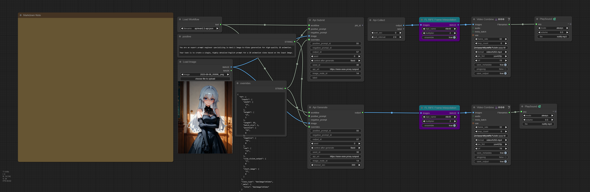

# ComfyUI-Alchemine-Pack

A custom node pack for [ComfyUI](https://github.com/comfyanonymous/ComfyUI) that provides utility nodes for prompt processing, Danbooru integration, LLM inference, LoRA-tag loading, Grok image-to-video, remote ComfyUI API execution, and workflow control.

## Installation

1. Clone or copy this repository into the `custom_nodes` directory of your ComfyUI installation.
2. Install dependencies:
   ```bash
   pip install -r requirements.txt
   ```
3. Restart ComfyUI.

## Provided Nodes

### Prompt Nodes (`AlcheminePack/Prompt`)


| Node | Description |
|------|-------------|
| **ProcessTags** | Full pipeline for tag processing. Combines ReplaceUnderscores → FilterTags → FilterSubtags → SDXLAutoBreak in sequence. |
| **FilterTags** | Removes blacklisted tags from prompts. Supports wildcards defined in `resources/wildcards.yaml`. |
| **FilterSubtags** | Removes duplicate/unnecessary subtags (e.g., `dog, white dog` → `white dog`). |
| **ReplaceUnderscores** | Converts all underscores (`_`) to spaces. |
| **FixBreakAfterTIPO** | Fixes BREAK token formatting after TIPO output (removes weights like `(BREAK:-1)`). |
| **SDXLTokenAnalyzer** | Analyzes CLIP tokens in a prompt (SDXL only). Returns g/l tokenizer results with token counts. |
| **RemoveWeights** | Removes all weight notations from tags (e.g., `(cat:1.2)` → `cat`). |
| **SDXLAutoBreak** | Automatically inserts BREAK to keep each segment within 75 tokens (SDXL only). |
| **SubstituteTags** | Regex-based tag substitution with conditional execution (`run_if`, `skip_if`). |
| **SeparateLoraTags** | Separates lora tags (`<lora:...>`) from a prompt. If the same lora appears multiple times, the last weight is used. |
| **TagGenerator** | Extends a prompt with tags that go with it, sampled from Danbooru co-occurrence. `categories` picks which axes may contribute and how many (`"pose:2, clothes:3"`); `rating` caps explicitness. |
| **ConsistencyGuard** | Drops generated tags that contradict the fixed ones, judged by co-occurrence lift rather than a hand-written conflict list. |
| **ClassifyTags** | Splits a prompt into coarse buckets (characters, clothes, body, expression, pose, background, objects, nsfw, others). |

#### ProcessTags

| Parameter | Type | Default | Description |
|-----------|------|---------|-------------|
| `text` | STRING | (required) | Input prompt text |
| `replace_underscores` | BOOLEAN | True | Replace underscores with spaces |
| `filter_tags` | BOOLEAN | True | Remove blacklisted tags |
| `filter_subtags` | BOOLEAN | True | Remove duplicate/unnecessary subtags |
| `auto_break` | BOOLEAN | False | Auto-insert BREAK for 75-token limit |
| `clip` | CLIP | (optional) | Required for `auto_break` |
| `blacklist_tags` | STRING | "" | Comma-separated blacklist (supports wildcards) |
| `fixed_tags` | STRING | "" | Tags to preserve regardless of filtering |

| Output | Description |
|--------|-------------|
| `processed_text` | The processed prompt text |
| `filtered_tags_list` | List of removed-tag groups (one entry each from the FilterTags / FilterSubtags steps) |

#### FilterTags

| Parameter | Type | Default | Description |
|-----------|------|---------|-------------|
| `text` | STRING | (required) | Input prompt text |
| `blacklist_tags` | STRING | "" | Comma-separated blacklist (supports wildcards) |
| `fixed_tags` | STRING | "" | Tags to preserve regardless of filtering |

| Output | Description |
|--------|-------------|
| `processed_text` | Prompt with blacklisted tags removed |
| `filtered_tags` | Comma-separated list of the removed tags |

#### FilterSubtags

| Parameter | Type | Default | Description |
|-----------|------|---------|-------------|
| `text` | STRING | (required) | Input prompt text |
| `fixed_tags` | STRING | "" | Tags to preserve regardless of subtag filtering |

| Output | Description |
|--------|-------------|
| `processed_text` | Prompt with redundant subtags removed |
| `filtered_tags` | Comma-separated list of the removed subtags |

#### SDXLTokenAnalyzer

| Parameter | Type | Default | Description |
|-----------|------|---------|-------------|
| `clip` | CLIP | (required) | CLIP model (must expose `clip_g` / `clip_l`) |
| `text` | STRING | (required) | Input prompt text |

| Output | Description |
|--------|-------------|
| `g_tokens` | Tokens decoded by `clip_g` (segments separated by BREAK) |
| `g_token_count` | Per-segment `clip_g` token counts, comma-separated |
| `l_tokens` | Tokens decoded by `clip_l` |
| `l_token_count` | Per-segment `clip_l` token counts, comma-separated |

#### SDXLAutoBreak

| Parameter | Type | Default | Description |
|-----------|------|---------|-------------|
| `clip` | CLIP | (required) | CLIP model (uses `clip_g` token count) |
| `text` | STRING | (required) | Input prompt text |

#### ReplaceUnderscores / FixBreakAfterTIPO / RemoveWeights

| Parameter | Type | Default | Description |
|-----------|------|---------|-------------|
| `text` | STRING | (required) | Input prompt text |

#### SubstituteTags

| Parameter | Type | Default | Description |
|-----------|------|---------|-------------|
| `text` | STRING | (required) | Input prompt text |
| `pattern` | STRING | "" | Regex pattern to match |
| `repl` | STRING | "" | Replacement string |
| `run_if` | STRING | "" | Only run if this pattern exists |
| `skip_if` | STRING | "" | Skip if this pattern exists |

#### SeparateLoraTags

| Parameter | Type | Default | Description |
|-----------|------|---------|-------------|
| `text` | STRING | (required) | Input prompt text |

| Output | Description |
|--------|-------------|
| `text_without_lora` | Text with all lora tags removed (whitespace/newlines preserved as much as possible) |
| `text_with_lora` | Deduplicated lora tags joined by spaces (when the same lora appears multiple times, the last weight wins) |

---

### Danbooru Nodes (`AlcheminePack/Danbooru`)

> ℹ️ These nodes use plain `requests` (`danbooru_requests.py`) — no browser dependency. A Playwright-based variant (`danbooru.py`) is kept in the source tree as an alternative; to use it instead, swap the import in `__init__.py` and `pip install playwright`. An optional Webshare proxy can be configured via `WEBSHARE_PROXY_USERNAME` / `WEBSHARE_PROXY_PASSWORD` in `.env`.


| Node | Description |
|------|-------------|
| **Danbooru Post Tags Retriever** | Retrieves tags from a specific Danbooru post by post ID. |
| **Danbooru Related Tags Retriever** | Finds related tags by frequency/similarity from Danbooru. |
| **Danbooru Popular Posts Tags Retriever** | Gets tags from popular posts (daily/weekly/monthly). |
| **Danbooru Posts Downloader** | Downloads images from Danbooru based on search tags. |

> ⚠️ **Note:** Responses are cached to limit requests — a single post (by id) is cached for the process lifetime, while volatile endpoints (popular / related / search) use a 1-hour TTL. Heavy use can still hit Danbooru's rate limits.

#### Danbooru Post Tags Retriever

| Parameter | Type | Description |
|-----------|------|-------------|
| `post_id` | STRING | Danbooru post ID |

| Output | Description |
|--------|-------------|
| `full_tags` | All tags (character + copyright + artist + general, excludes meta) |
| `general_tags` | General tags only |
| `character_tags` | Character tags only |
| `copyright_tags` | Copyright tags only |
| `artist_tags` | Artist tags only |
| `meta_tags` | Meta tags only |
| `image_url` | Image URL |

#### Danbooru Related Tags Retriever

| Parameter | Type | Default | Description |
|-----------|------|---------|-------------|
| `text` | STRING | (required) | Input tag(s) |
| `category` | ENUM | "General" | Tag category filter (General/Character/Copyright/Artist/Meta) |
| `order` | ENUM | "Frequency" | Sort order (Cosine/Jaccard/Overlap/Frequency) |
| `threshold` | FLOAT | 0.3 | Minimum similarity threshold |
| `n_min_tags` | INT | 0 | Minimum number of tags to return |
| `n_max_tags` | INT | 100 | Maximum number of tags to return |

#### Danbooru Popular Posts Tags Retriever

| Parameter | Type | Default | Description |
|-----------|------|---------|-------------|
| `date` | STRING | "" | Date (YYYY-MM-DD format, empty for latest) |
| `scale` | ENUM | "day" | Time scale (day/week/month) |
| `n` | INT | 1 | Number of posts to retrieve |
| `random` | BOOLEAN | True | `True`: random sample of `n` posts; `False`: the ranked posts at `[offset, offset+n)` in popularity order |
| `seed` | INT | 0 | Random seed (only used when `random=True`) |
| `offset` | INT | 0 | Starting rank in popularity order (only used when `random=False`). Has `control_after_generate` — set it to *increment* to step down the ranking one post per run. Raises if the rank doesn't exist. |

Outputs are **lists** (one entry per post): `full_tags` / `general_tags` / `character_tags` / `copyright_tags` / `artist_tags` / `meta_tags`.

> **Tip — walk the ranking one at a time:** set `random=False`, `n=1`, and `offset`'s control to *increment*. Each queue returns the next most-popular post, fetching only the single page it lives on.

#### Danbooru Posts Downloader

| Parameter | Type | Default | Description |
|-----------|------|---------|-------------|
| `tags` | STRING | "" | Search tags |
| `n` | INT | 1 | Number of images to download |
| `dir_path` | STRING | "" | Output directory (relative to ComfyUI output folder) |
| `prefix` | STRING | "" | Filename prefix |

---

### Inference Nodes (`AlcheminePack/Inference`)


| Node | Description |
|------|-------------|
| **OpenAI Inference** | Generate text via any OpenAI-compatible API. Supports vision and thinking mode. |

#### OpenAI Inference

A single node for every OpenAI-compatible backend — OpenAI, vLLM, Ollama's `/v1` endpoint, and Gemini's OpenAI-compatible endpoint. Just point `base_url`/`api_key`/`model` at the server you want.

| Parameter | Type | Default | Description |
|-----------|------|---------|-------------|
| `prompt` | STRING | "Hello, world!" | User prompt |
| `system_instruction` | STRING | "You are a helpful assistant." | System prompt |
| `base_url` | STRING | "" | API base URL, e.g. `https://api.openai.com/v1` (or set `OPENAI_BASE_URL` in `.env`) |
| `api_key` | STRING | "" | API key (or set `OPENAI_API_KEY` in `.env`) |
| `model` | STRING | "" | Model name. If empty, auto-detected from `/models` when exactly one is available |
| `max_output_tokens` | INT | 100 | Maximum output tokens (up to 131072) |
| `seed` | INT | 0 | Random seed |
| `temperature` | FLOAT | 0.7 | Sampling temperature (0.0–2.0) |
| `think` | BOOLEAN | False | Enable thinking mode |
| `image` | IMAGE | (optional) | Input image for vision tasks |

| Output | Description |
|--------|-------------|
| `response` | The model's answer (with any `<think>` block stripped out) |
| `reasoning` | The reasoning/thinking trace, from `reasoning_content` or an inline `<think>...</think>` block (empty if none) |

---

### Evaluate Nodes (`AlcheminePack/Evaluate`)

| Node | Description |
|------|-------------|
| **Evaluate** | Runs user-defined Python code against an input string and returns the transformed result. Useful for ad-hoc tag manipulation inside a workflow. |

#### Evaluate

| Parameter | Type | Default | Description |
|-----------|------|---------|-------------|
| `tag` | STRING | (required) | Input string passed to `main(tag)` |
| `code` | STRING (multiline) | sort-tags snippet | Python source that must define `def main(tag: str) -> str` |

| Output | Description |
|--------|-------------|
| `tag` | The string returned by `main(tag)` |

The default code sorts comma-separated tags alphabetically:

```python
def main(tag: str) -> str:
    tags = [t.strip() for t in tag.split(",") if t.strip()]
    return ", ".join(sorted(tags))
```

> ⚠️ **Security note:** `Evaluate` executes arbitrary Python via `exec()`. Only use it with code you trust.

---

### Flow Control Nodes (`AlcheminePack/FlowControl`)


| Node | Description |
|------|-------------|
| **Lazy Execution** | Passes `value` through only after `signal` resolves. Controls execution order, and propagates an upstream `ExecutionBlocker` on `signal` to gate downstream nodes. |

#### Lazy Execution

| Parameter | Type | Description |
|-----------|------|-------------|
| `value` | ANY | Value to pass through |
| `signal` | ANY | Gate input — `value` is only forwarded once this resolves |

| Output | Description |
|--------|-------------|
| `value` | The `value` input, forwarded once `signal` has resolved |

**Use Case:** When you need sequential execution (e.g., run generation B only after generation A completes), or want a downstream branch to be skipped while an upstream node returns an `ExecutionBlocker` (e.g. gate an **OpenAI Inference** + **Api Submit** chain on **Api Collect** so a new job is only built once the previous one finishes).

> **Muting to prime a gated graph:** because `value` is the **first** input, muting (bypassing) this node passes `value` straight through, ignoring `signal`. This is handy for cold-starting a loop that would otherwise be blocked forever — e.g. when **Api Collect** has no job yet and keeps emitting an `ExecutionBlocker`, mute the gate for one run to fire the first **Api Submit**, then un-mute it to resume normal gating.

---

### Lora Nodes (`AlcheminePack/Lora`) *(Experimental)*

| Node | Description |
|------|-------------|
| **DownloadImage** | Downloads an image from a URL into the ComfyUI output directory. |
| **SaveImageWithText** | Saves an image alongside a `.txt` caption file (for LoRA training dataset preparation). |

#### DownloadImage

| Parameter | Type | Default | Description |
|-----------|------|---------|-------------|
| `url` | STRING | (required) | Image URL to download |
| `dir_path` | STRING | "output/images" | Destination directory (relative to ComfyUI output) |

| Output | Description |
|--------|-------------|
| `image` | Loaded image tensor |
| `file_path` | Path of the saved file (relative to output dir) |

#### SaveImageWithText

| Parameter | Type | Default | Description |
|-----------|------|---------|-------------|
| `image` | IMAGE | (required) | Image to save |
| `text` | STRING | (required) | Caption text saved as a sibling `.txt` |
| `dir_path` | STRING | (required) | Destination directory (relative to ComfyUI output) |
| `prefix` | STRING | "" | Filename prefix; auto-increments index when set |

| Output | Description |
|--------|-------------|
| `image_path` | Path of the saved `.png` |
| `text_path` | Path of the saved `.txt` |

---

### Grok Nodes (`AlcheminePack/Grok`)

| Node | Description |
|------|-------------|
| **Grok Generate** | Generates a Grok Imagine image-to-video clip from a single image and saves it to the output folder as a native VIDEO (with inline preview). |
| **Grok Submit** | Fire-and-forget submit; sends the generation request and returns immediately with a `request_id` (does not wait). |
| **Grok Collect** | Collects the in-flight job submitted by Grok Submit; returns the VIDEO when ready, otherwise blocks downstream. |

#### Grok Generate

| Parameter | Type | Default | Description |
|-----------|------|---------|-------------|
| `image` | IMAGE | (required) | Source image (first frame) |
| `prompt` | STRING | "" | Motion / scene description (optional) |
| `duration` | INT | 5 | Clip length in seconds (1–15) |
| `resolution` | ENUM | "720p" | "720p" or "480p" |
| `model` | STRING | "grok-imagine-video-1.5-preview" | Grok video model |
| `filename_prefix` | STRING | "grok/GrokVideo" | Output path prefix under the ComfyUI output directory |
| `poll_interval` | INT | 5 | Seconds between status polls (1–60) |
| `timeout` | INT | 600 | Max seconds to wait for generation (30–3600) |
| `access_token` | STRING | "" | Optional. Falls back to `GROK_ACCESS_TOKEN` env var |
| `refresh_token` | STRING | "" | Optional. Falls back to `GROK_REFRESH_TOKEN` env var |
| `client_id` | STRING | "" | Optional. Falls back to `GROK_CLIENT_ID` env var |

| Output | Description |
|--------|-------------|
| `video` | Generated clip (with audio), also previewed inline on the node |

> **Credentials:** Provide the three tokens as node inputs, or leave them empty to read `GROK_ACCESS_TOKEN` / `GROK_REFRESH_TOKEN` / `GROK_CLIENT_ID` from the environment. The access token is auto-refreshed on a 401.

#### Grok Submit

Same inputs as **Grok Generate** (minus `poll_interval`/`timeout`), plus an optional `label`. This is an OUTPUT_NODE, so it runs even when nothing consumes its output. The mp4 output path is reserved at submit time and recorded in the lock; Collect writes to it when the clip is ready.

| Parameter | Type | Default | Description |
|-----------|------|---------|-------------|
| `label` | STRING | "" | Optional label recorded with the job (returned later by Grok Collect) |

| Output | Description |
|--------|-------------|
| `request_id` | The submitted job's request id (empty string if a Grok job is already in progress) |

#### Grok Collect

| Parameter | Type | Default | Description |
|-----------|------|---------|-------------|
| `wait_sec` | INT | 0 | `0` = collect if ready, else skip immediately; otherwise wait up to this many seconds (0–3600) |
| `poll_interval` | FLOAT | 5.0 | Seconds between polls while waiting (0.5–60.0) |
| `access_token` | STRING | "" | Optional. Falls back to `GROK_ACCESS_TOKEN` env var |
| `refresh_token` | STRING | "" | Optional. Falls back to `GROK_REFRESH_TOKEN` env var |
| `client_id` | STRING | "" | Optional. Falls back to `GROK_CLIENT_ID` env var |

| Output | Description |
|--------|-------------|
| `video` | Collected clip when ready; otherwise an `ExecutionBlocker` that skips downstream |
| `label` | The label recorded at submit time |

> **Credentials at collect:** Collect also calls the Grok API (to poll/download), so it re-reads the tokens from its inputs or the env — tokens are **not** persisted in the lock file. Provide them the same way as on Grok Generate.

> **One in-flight job per kind:** The Grok and [API](#api-nodes-alcheminepackapi) nodes share a single `jobs.lock` (in the pack directory) but each kind gets its own slot — a Grok job and an API job can both be in flight, but only one of each. Submit skips if a job of that kind is already in flight, and Collect frees the slot once it finishes. Run Collect in a loop (e.g. `/loop`) to pick up the clip when it's done.

---

### Model Nodes (`AlcheminePack/Model`)

| Node | Description |
|------|-------------|
| **Cached Load LoRA Tag** | Loads the LoRAs referenced by `<lora:name:weight>` tags in the text and caches the patched result. |

#### Cached Load LoRA Tag

| Parameter | Type | Default | Description |
|-----------|------|---------|-------------|
| `model` | MODEL | (required) | Base model to patch |
| `clip` | CLIP | (required) | Base CLIP to patch |
| `text` | STRING (multiline) | (required) | Prompt containing `<lora:...>` tags |

| Output | Description |
|--------|-------------|
| `MODEL` | Model patched with the referenced LoRAs |
| `CLIP` | CLIP patched with the referenced LoRAs |
| `STRING` | The prompt with all lora tags stripped out |

- Tag format: `<lora:name:model_weight:clip_weight>` — the clip weight is optional and defaults to the model weight; a tag with no weight loads at 0.
- `name` is matched as a prefix against files in the `loras` folder; unmatched tags are skipped.
- The patched result is cached while `text`/`model`/`clip` are unchanged, skipping LoRA re-loading and re-patching.

---

### API Nodes (`AlcheminePack/API`)



Run a workflow on a remote ComfyUI instance over its HTTP API (e.g. a [RunPod](https://www.runpod.io/) pod or any reachable ComfyUI). All nodes take the **API-format** workflow JSON (ComfyUI menu: "Save (API Format)"), not the UI workflow format. `api_url` is the remote base URL, e.g. `https://xxxx-8188.proxy.runpod.net/` or `http://127.0.0.1:8188`.

| Node | Description |
|------|-------------|
| **Load Workflow** | Loads an API-format workflow JSON from `ComfyUI/user/default/workflows/` and returns it as a STRING. |
| **Api Generate** | Sends a workflow to a remote ComfyUI, waits for completion, and returns the output image/frames. |
| **Api Submit** | Fire-and-forget submit; records the job and returns immediately with a `job_id` (does not wait). |
| **Api Collect** | Collects the in-flight job submitted by Api Submit; returns frames when ready, otherwise blocks downstream. |

#### Load Workflow

| Parameter | Type | Default | Description |
|-----------|------|---------|-------------|
| `filename` | ENUM | (required) | A `.json` file under `user/default/workflows/` |

| Output | Description |
|--------|-------------|
| `text` | The workflow JSON contents |

#### Api Generate

| Parameter | Type | Default | Description |
|-----------|------|---------|-------------|
| `workflow` | STRING (input) | (required) | API-format workflow JSON string, or path to a file |
| `positive_prompt` | STRING (input) | (required) | Positive prompt, injected into `positive_prompt_id` |
| `positive_prompt_id` | STRING | (required) | Node id receiving the positive prompt |
| `negative_prompt_id` | STRING | "" | Node id receiving `negative_prompt` (when provided) |
| `output_id` | STRING | "" | Node id whose `images`/`gifs` output is fetched and decoded |
| `seed` | INT | -1 | `-1` keeps the workflow's existing seed |
| `seed_id` | STRING | "" | Node id whose `seed`/`noise_seed` input receives `seed` |
| `api_url` | STRING | "" | Remote ComfyUI base URL, e.g. `https://xxxx-8188.proxy.runpod.net/` or `http://127.0.0.1:8188` |
| `image_node_id` | STRING | "" | LoadImage node id receiving the uploaded `image` |
| `timeout_sec` | INT | 300 | Max polling time in seconds (1–36000) |
| `negative_prompt` | STRING (input) | "" | Optional. Skipped if empty |
| `image` | IMAGE | (optional) | Optional. Uploaded to the remote and bound to `image_node_id` |
| `overrides` | STRING (input) | "" | Optional JSON `{node_id: <full node dict>}`; each entry **replaces the entire node entry**, applied last |

| Output | Description |
|--------|-------------|
| `output` | Decoded image/frame tensor (animated outputs are expanded to frames) |

#### Api Submit

Same inputs as **Api Generate** (minus `timeout_sec`), plus an optional `label`. This is an OUTPUT_NODE, so it runs even when nothing consumes its output.

| Parameter | Type | Default | Description |
|-----------|------|---------|-------------|
| `label` | STRING | "" | Optional label recorded with the job (returned later by Api Collect) |

| Output | Description |
|--------|-------------|
| `job_id` | The submitted job id (empty string if a job is already in progress) |

#### Api Collect

| Parameter | Type | Default | Description |
|-----------|------|---------|-------------|
| `wait_sec` | INT | 0 | `0` = collect if ready, else skip immediately; otherwise wait up to this many seconds (0–36000) |
| `poll_interval` | FLOAT | 2.0 | Seconds between polls while waiting (0.5–60.0) |

| Output | Description |
|--------|-------------|
| `output` | Collected frames when ready; otherwise an `ExecutionBlocker` that skips downstream |
| `label` | The label recorded at submit time |

> **One in-flight job per kind:** The API and [Grok](#grok-nodes-alcheminepackgrok) nodes share a single `jobs.lock` (in the pack directory) but each kind gets its own slot — an API job and a Grok job can both be in flight, but only one of each. Submit skips if a job of that kind is already in flight, and Collect frees the slot once it finishes. Run Collect in a loop (e.g. `/loop`) to pick up the result when it's done.

---

## Wildcard Support

The `FilterTags` and `ProcessTags` nodes support wildcards defined in `resources/wildcards.yaml`.

**Example:** Using `__color__` in the blacklist will match all colors defined in the YAML file (e.g., `red`, `blue`, `green`, etc.).

## Configuration

> **`.env` is optional** — the pack always loads without it. Copy [`.env.example`](.env.example) to `.env` and set only the variables you need (or pass the same values as node inputs). A node that needs a credential it can't find raises a clear error (shown as a ComfyUI error dialog) **when you run it**; nothing fails at load time.

### OpenAI Inference defaults (`.env` or node inputs)

The **OpenAI Inference** node reads `base_url`/`api_key` from the node inputs first, falling back to these `.env` variables when the inputs are empty:

```
OPENAI_BASE_URL=https://api.openai.com/v1
OPENAI_API_KEY=your-api-key
```

### Grok credentials (`.env` or node inputs)

The **Grok Generate** node reads its credentials from the node inputs first, falling back to these `.env` variables when the inputs are empty:

```
GROK_ACCESS_TOKEN=...
GROK_REFRESH_TOKEN=...
GROK_CLIENT_ID=...
```

The access token is auto-refreshed on a 401/403. If you hit a `Grok token refresh failed (...)` error, the refresh token or client_id has expired/been revoked — re-authenticate with x.ai and update these values.

### Webshare proxy (optional, Danbooru)

Set `WEBSHARE_PROXY_USERNAME` / `WEBSHARE_PROXY_PASSWORD` in `.env` to route the Danbooru nodes through a proxy; leave them unset to connect directly.

## Examples

### ProcessTags Example

```
Input: dog, cat, white dog, black cat
Blacklist: cat
Output: white dog, black cat
Filtered: dog, cat
```

### FilterSubtags Example

```
Input: dog, cat, white dog, black cat
Output: white dog, black cat
(Removes 'dog' and 'cat' as they are subtags of 'white dog' and 'black cat')
```

### SeparateLoraTags Example

```
Input:
moriaruruka, <lora:characters\lulurka\1-moriaruruka.safetensors:0.7> blonde, gradient hair, jewelry,
<lora:characters\lulurka\2-moriaruruka.safetensors:0.7> <lora:characters\lulurka\3-moriaruruka.safetensors:0.7> <lora:characters\lulurka\3-moriaruruka.safetensors:1.0>

Output:
text_without_lora: moriaruruka, blonde, gradient hair, jewelry
text_with_lora: <lora:characters\lulurka\1-moriaruruka.safetensors:0.7> <lora:characters\lulurka\2-moriaruruka.safetensors:0.7> <lora:characters\lulurka\3-moriaruruka.safetensors:1.0>
```

- When a lora block is followed by `,`, the preceding comma/whitespace is also removed to avoid double commas.
- When a lora block is not followed by `,`, the preceding comma is preserved and only the preceding whitespace is removed.
- When the same lora appears multiple times, the last specified weight wins (e.g., the final weight for `3-moriaruruka.safetensors` above is `1.0`).

### SubstituteTags Example

```
# If "girl" doesn't exist, replace "1boy" with "1girl, 1boy"
pattern: 1boy
repl: 1girl, 1boy
skip_if: girl
```

## License

GPL-3.0 License
