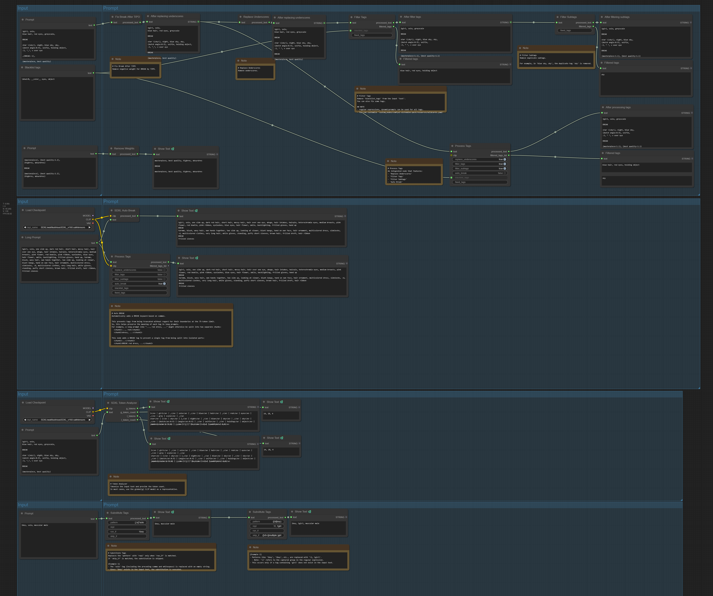
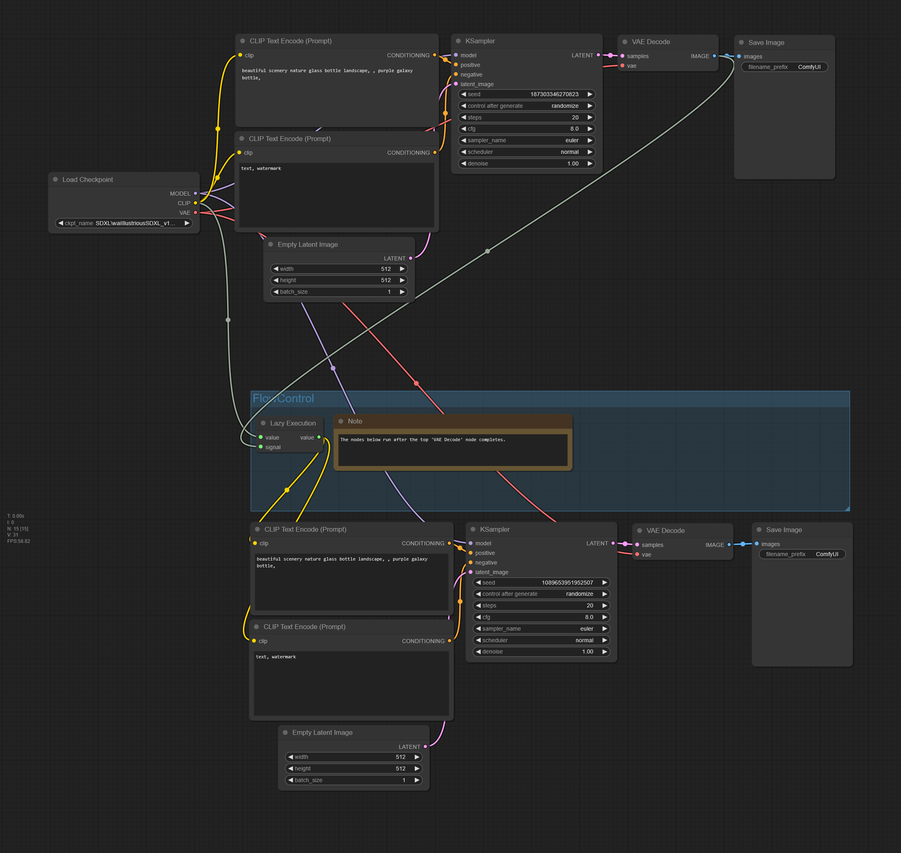

# ComfyUI-Alchemine-Pack

A custom node pack for [ComfyUI](https://github.com/comfyanonymous/ComfyUI) that provides utility nodes for prompt processing, LoRA-tag loading, workflow control, image adjustment, and input broadcasting.

## Related Packs

| Pack | Nodes |
|------|-------|
| [comfyui-generator-pack](https://github.com/alchemine/comfyui-generator-pack) | Tags suggested from a Danbooru dataset, sentence-to-tags and character tags: Tags Generator, Tags Extractor, Character Tags Generator, Tags Conflict Filter, Classify Tags, Group Tags |
| [comfyui-daam-pack](https://github.com/alchemine/comfyui-daam-pack) | Cross-attention heatmaps per prompt tag: Sampler Custom (DAAM), DAAM Tag Explorer |
| [comfyui-danbooru-pack](https://github.com/alchemine/comfyui-danbooru-pack) | Danbooru tag retrievers and posts downloader |
| [comfyui-evaluate-pack](https://github.com/alchemine/comfyui-evaluate-pack) | Evaluate: transforms a string with Python code written in the node |
| [comfyui-api-pack](https://github.com/alchemine/comfyui-api-pack) | External APIs: zero-shot classification, OpenAI Inference, remote ComfyUI API (Api Generate / Submit / Collect, Load Workflow), Grok image-to-video |

Nodes that moved out of this pack kept their node ids, so existing workflows load once the pack that owns them is installed.

## Installation

1. Clone or copy this repository into the `custom_nodes` directory of your ComfyUI installation.
2. Restart ComfyUI.

## Provided Nodes

### Prompt Nodes (`AlcheminePack/Prompt`)



| Node | Description |
|------|-------------|
| **ProcessTags** | Full pipeline for tag processing. Combines ReplaceUnderscores → FilterTags → FilterSubtags → FilterColors → FilterPlurals → SDXLAutoBreak in sequence. |
| **FilterTags** | Removes blacklisted tags from prompts. Supports wildcards defined in `resources/wildcards.yaml`. |
| **FilterSubtags** | Removes duplicate/unnecessary subtags (e.g., `dog, white dog` → `white dog`). |
| **ReplaceUnderscores** | Converts all underscores (`_`) to spaces. |
| **FixBreakAfterTIPO** | Fixes BREAK token formatting after TIPO output (removes weights like `(BREAK:-1)`). |
| **SDXLTokenAnalyzer** | Analyzes CLIP tokens in a prompt (SDXL only). Returns g/l tokenizer results with token counts. |
| **RemoveWeights** | Removes all weight notations from tags (e.g., `(cat:1.2)` → `cat`). |
| **FilterColors** | Keeps one colour per thing: of `red dress, blue dress`, the first. Colours come from the `color` key of `resources/wildcards.yaml`. |
| **FilterPlurals** | Of two tags that differ only by a plural `s` (`arm up, arms up`), keeps the first. |
| **BoySubjectFilter** | When a tag needs a man (`sex`, `hetero`, `penis`, anything spelled with `another`), removes `solo` and, if no boy is counted, adds `((1boy))` and `add_tags`. |
| **SDXLAutoBreak** | Automatically inserts BREAK to keep each segment within 75 tokens (SDXL only). |
| **SubstituteTags** | Regex-based tag substitution with conditional execution (`run_if`, `skip_if`). |
| **SeparateLoraTags** | Separates lora tags (`<lora:...>`) from a prompt. If the same lora appears multiple times, the last weight is used. |
| **TextPrompt** | Plain multiline text input with `dynamicPrompts` off, so typing `{a|b}` no longer jumps the cursor to the end. Wildcards are expanded in Python instead. |

#### ProcessTags

| Parameter | Type | Default | Description |
|-----------|------|---------|-------------|
| `text` | STRING | (required) | Input prompt text |
| `replace_underscores` | BOOLEAN | True | Replace underscores with spaces |
| `filter_tags` | BOOLEAN | True | Remove blacklisted tags |
| `filter_subtags` | BOOLEAN | True | Remove duplicate/unnecessary subtags |
| `filter_colors` | BOOLEAN | True | Keep one colour per thing (FilterColors) |
| `filter_plurals` | BOOLEAN | True | Keep the first of two tags that differ only by a plural `s` (FilterPlurals) |
| `auto_break` | BOOLEAN | False | Auto-insert BREAK for 75-token limit |
| `clip` | CLIP | (optional) | Required for `auto_break` |
| `blacklist_tags` | STRING | "" | Comma-separated blacklist (supports wildcards) |
| `fixed_tags` | STRING | "" | Tags to preserve regardless of filtering |

| Output | Description |
|--------|-------------|
| `processed_text` | The processed prompt text |
| `filtered_tags_list` | List of removed-tag groups (one entry each from the FilterTags / FilterSubtags / FilterColors / FilterPlurals steps) |

> ⚠️ **6.0.0:** `filter_colors` and `filter_plurals` sit between `filter_subtags` and `auto_break`. In a workflow saved
> before 6.0.0 the values of `auto_break`, `blacklist_tags` and `fixed_tags` shift by two widgets; set them again.
> An API-format workflow needs the two new inputs added.

#### FilterTags

| Parameter | Type | Default | Description |
|-----------|------|---------|-------------|
| `text` | STRING | (required) | Input prompt text |
| `blacklist_tags` | STRING | "" | Comma-separated blacklist (supports wildcards) |
| `fixed_tags` | STRING | "" | Tags to preserve regardless of filtering |

| Output | Description |
|--------|-------------|
| `processed_text` | Prompt with blacklisted tags removed |
| `filtered_tags` | Comma-separated list of the removed tags |

#### FilterSubtags

| Parameter | Type | Default | Description |
|-----------|------|---------|-------------|
| `text` | STRING | (required) | Input prompt text |
| `fixed_tags` | STRING | "" | Tags to preserve regardless of subtag filtering |

| Output | Description |
|--------|-------------|
| `processed_text` | Prompt with redundant subtags removed |
| `filtered_tags` | Comma-separated list of the removed subtags |

#### SDXLTokenAnalyzer

| Parameter | Type | Default | Description |
|-----------|------|---------|-------------|
| `clip` | CLIP | (required) | CLIP model (must expose `clip_g` / `clip_l`) |
| `text` | STRING | (required) | Input prompt text |

| Output | Description |
|--------|-------------|
| `g_tokens` | Tokens decoded by `clip_g` (segments separated by BREAK) |
| `g_token_count` | Per-segment `clip_g` token counts, comma-separated |
| `l_tokens` | Tokens decoded by `clip_l` |
| `l_token_count` | Per-segment `clip_l` token counts, comma-separated |

#### SDXLAutoBreak

| Parameter | Type | Default | Description |
|-----------|------|---------|-------------|
| `clip` | CLIP | (required) | CLIP model (uses `clip_g` token count) |
| `text` | STRING | (required) | Input prompt text |

#### ReplaceUnderscores / FixBreakAfterTIPO / RemoveWeights

| Parameter | Type | Default | Description |
|-----------|------|---------|-------------|
| `text` | STRING | (required) | Input prompt text |

#### FilterColors / FilterPlurals

| Parameter | Type | Default | Description |
|-----------|------|---------|-------------|
| `text` | STRING | (required) | Input prompt text |

| Output | Description |
|--------|-------------|
| `processed_text` | Prompt with the repeated tags removed |
| `filtered_tags` | The removed tags |

#### BoySubjectFilter

| Parameter | Type | Default | Description |
|-----------|------|---------|-------------|
| `text` | STRING | (required) | Input prompt text |
| `add_tags` | STRING | "(hetero:1.1), (couple:1.1), (deep skin:1.1)" | Tags added after `((1boy))` when no boy is counted |

A prompt without a tag that needs a man is returned unchanged. Tags are matched whole (`sex toy`, `sexy` do not
match), tags starting with `after ` are skipped, and underscores and case are ignored.

#### SubstituteTags

| Parameter | Type | Default | Description |
|-----------|------|---------|-------------|
| `text` | STRING | (required) | Input prompt text |
| `pattern` | STRING | "" | Regex pattern to match |
| `repl` | STRING | "" | Replacement string |
| `run_if` | STRING | "" | Only run if this pattern exists |
| `skip_if` | STRING | "" | Skip if this pattern exists |

#### SeparateLoraTags

| Parameter | Type | Default | Description |
|-----------|------|---------|-------------|
| `text` | STRING | (required) | Input prompt text |

| Output | Description |
|--------|-------------|
| `text_without_lora` | Text with all lora tags removed (whitespace/newlines preserved as much as possible) |
| `text_with_lora` | Deduplicated lora tags joined by spaces (when the same lora appears multiple times, the last weight wins) |

#### TextPrompt

ComfyUI's built-in text widget has `dynamicPrompts` enabled, which re-parses
the field as you type: writing `{a|b}` moves the cursor to the end on every
keystroke. This node turns the flag off, so the widget behaves like a plain
text box, and resolves the `{option1|option2|...}` syntax in Python at
execution time instead (one random pick per group, nesting supported).

When [ComfyUI-Impact-Pack](https://github.com/ltdrdata/ComfyUI-Impact-Pack) is
installed, its wildcard engine is used instead, so `__wildcard__` file
references, `$$` multi-select and `#` comments are also resolved — a TextPrompt
can stand in for an ImpactWildcardProcessor node. Without it, only the `{a|b}`
syntax is resolved.

| Parameter | Type | Default | Description |
|-----------|------|---------|-------------|
| `text` | STRING | (required) | Multiline prompt text; `{a|b}` groups are expanded on execution |
| `seed` | INT | 0 | Input-only; seeds the wildcard picks so a run is reproducible |

| Output | Description |
|--------|-------------|
| `text` | Prompt with every wildcard group resolved |

---

### Image Nodes (`AlcheminePack/Image`)

#### AdjustImage

Colour correction, a suite of sharpen/denoise filters and optional resizing in
one node. Every knob defaults to a no-op, so the node passes the image through
untouched until a slider is moved. All adjustments are torch ops running on the
image's own device, so a GPU tensor never round-trips through numpy; RGB is
processed and an existing alpha channel is passed through untouched.

The order is fixed and deliberate: brightness → contrast → saturation → gamma →
denoise → edge enhance → CAS → local contrast → resize. Denoise runs before any
sharpening so the sharpeners do not amplify the noise they were meant to remove.

| Parameter | Type | Default | Description |
|-----------|------|---------|-------------|
| `image` | IMAGE | (required) | Input image |
| `brightness` | FLOAT | 1.0 | 1.0 = no change, <1.0 darker, >1.0 brighter |
| `contrast` | FLOAT | 1.0 | Scales around mid-gray 0.5 |
| `saturation` | FLOAT | 1.0 | 0.0 = grayscale, >1.0 = more vivid |
| `gamma` | FLOAT | 1.0 | <1.0 brightens mid-tones, >1.0 darkens them |
| `edge_enhance` | FLOAT | 0.0 | Blend factor for a fixed edge-enhance kernel |
| `cas` | FLOAT | 0.0 | Contrast Adaptive Sharpening (AMD FidelityFX). Sharpens flat regions more and already-sharp edges less, so it avoids crunchy line art |
| `local_contrast` | FLOAT | 0.0 | Large-radius unsharp ("clarity"); adds mid-scale depth |
| `denoise` | FLOAT | 0.0 | Edge-preserving bilateral filter; removes flat noise and banding while keeping lines |
| `upscale_method` | COMBO | lanczos | Resampling used when `scale_by` != 1.0 |
| `scale_by` | FLOAT | 1.0 | Scale factor; 1.0 = no resize |

| Output | Description |
|--------|-------------|
| `image` | Adjusted image |

---

### Everywhere Nodes (`AlcheminePack/Everywhere`)

| Node | Description |
|------|-------------|
| **Everywhere** | A [cg-use-everywhere](https://github.com/chrisgoringe/cg-use-everywhere) broadcaster with fixed, named inputs (`model`, `clip`, `vae`, `positive`, `negative`, `latent_image`, `seed`, `blacklist`). The pinned input names keep UE's name-based routing working, so the two conditionings stay apart without renaming slots by hand. Requires cg-use-everywhere. |

---

### Flow Control Nodes (`AlcheminePack/FlowControl`)



| Node | Description |
|------|-------------|
| **Lazy Execution** | Passes `value` through only after `signal` resolves. Controls execution order, and propagates an upstream `ExecutionBlocker` on `signal` to gate downstream nodes. |

#### Lazy Execution

| Parameter | Type | Description |
|-----------|------|-------------|
| `value` | ANY | Value to pass through |
| `signal` | ANY | Gate input — `value` is only forwarded once this resolves |

| Output | Description |
|--------|-------------|
| `value` | The `value` input, forwarded once `signal` has resolved |

**Use Case:** When you need sequential execution (e.g., run generation B only after generation A completes), or want a downstream branch to be skipped while an upstream node returns an `ExecutionBlocker` (e.g. gate **Api Submit** from [comfyui-api-pack](https://github.com/alchemine/comfyui-api-pack) on **Api Collect** so a new job is only submitted once the previous one finishes).

> **Muting to prime a gated graph:** because `value` is the **first** input, muting (bypassing) this node passes `value` straight through, ignoring `signal`. This is handy for cold-starting a loop that would otherwise be blocked forever — e.g. when **Api Collect** has no job yet and keeps emitting an `ExecutionBlocker`, mute the gate for one run to fire the first **Api Submit**, then un-mute it to resume normal gating.

---

### Lora Nodes (`AlcheminePack/Lora`) *(Experimental)*

| Node | Description |
|------|-------------|
| **DownloadImage** | Downloads an image from a URL into the ComfyUI output directory. |
| **SaveImageWithText** | Saves an image alongside a `.txt` caption file (for LoRA training dataset preparation). |

#### DownloadImage

| Parameter | Type | Default | Description |
|-----------|------|---------|-------------|
| `url` | STRING | (required) | Image URL to download |
| `dir_path` | STRING | "output/images" | Destination directory (relative to ComfyUI output) |

| Output | Description |
|--------|-------------|
| `image` | Loaded image tensor |
| `file_path` | Path of the saved file (relative to output dir) |

#### SaveImageWithText

| Parameter | Type | Default | Description |
|-----------|------|---------|-------------|
| `image` | IMAGE | (required) | Image to save |
| `text` | STRING | (required) | Caption text saved as a sibling `.txt` |
| `dir_path` | STRING | (required) | Destination directory (relative to ComfyUI output) |
| `prefix` | STRING | "" | Filename prefix; auto-increments index when set |

| Output | Description |
|--------|-------------|
| `image_path` | Path of the saved `.png` |
| `text_path` | Path of the saved `.txt` |

---

### Model Nodes (`AlcheminePack/Model`)

| Node | Description |
|------|-------------|
| **Cached Load LoRA Tag** | Loads the LoRAs referenced by `<lora:name:weight>` tags in the text and caches the patched result. |

#### Cached Load LoRA Tag

| Parameter | Type | Default | Description |
|-----------|------|---------|-------------|
| `model` | MODEL | (required) | Base model to patch |
| `clip` | CLIP | (required) | Base CLIP to patch |
| `text` | STRING (multiline) | (required) | Prompt containing `<lora:...>` tags |

| Output | Description |
|--------|-------------|
| `MODEL` | Model patched with the referenced LoRAs |
| `CLIP` | CLIP patched with the referenced LoRAs |
| `STRING` | The prompt with all lora tags stripped out |

- Tag format: `<lora:name:model_weight:clip_weight>` — the clip weight is optional and defaults to the model weight. A tag without any numeric weight (`<lora:name>`) is not recognized as a lora tag: it is neither loaded nor stripped from the output text. Use `<lora:name:0>` to load at weight 0.
- `name` is matched as a prefix against files in the `loras` folder; unmatched tags are skipped.
- The patched result is cached while `text`/`model`/`clip` are unchanged, skipping LoRA re-loading and re-patching.

---

## Wildcard Support

The `FilterTags` and `ProcessTags` nodes support wildcards defined in `resources/wildcards.yaml`.

**Example:** Using `<color>` in the blacklist expands to every color defined in the YAML file, joined into one alternation — `(shiny|dark|colored|<color>) skin` blocks `blue skin`, `grey skin`, `two-tone skin` and the rest in one line.

Angle brackets, not the `__color__` form the wildcard packs use. A wildcard processor (ImpactWildcardProcessor, Dynamic Prompts) runs *upstream* of this node, so it resolves `__color__` before FilterTags ever sees it — and it resolves it by **picking one** value, which is the opposite of what a blacklist wants. No wildcard processor claims `<...>`, so the token survives them and arrives here intact. The `__color__` form still works for blacklists that never pass through one.

## Examples

### ProcessTags Example

```
Input: dog, cat, white dog, black cat
Blacklist: ^cat$
Output: white dog, black cat
Filtered: ['cat', 'dog']   (one entry per step: FilterTags, then FilterSubtags)
```

Blacklist tokens are regexes matched anywhere in a tag, so a bare `cat` would
also remove `black cat` — anchor with `^cat$` to match the tag exactly.

### FilterSubtags Example

```
Input: dog, cat, white dog, black cat
Output: white dog, black cat
(Removes 'dog' and 'cat' as they are subtags of 'white dog' and 'black cat')
```

### SeparateLoraTags Example

```
Input:
moriaruruka, <lora:characters\lulurka\1-moriaruruka.safetensors:0.7> blonde, gradient hair, jewelry,
<lora:characters\lulurka\2-moriaruruka.safetensors:0.7> <lora:characters\lulurka\3-moriaruruka.safetensors:0.7> <lora:characters\lulurka\3-moriaruruka.safetensors:1.0>

Output:
text_without_lora: moriaruruka, blonde, gradient hair, jewelry
text_with_lora: <lora:characters\lulurka\1-moriaruruka.safetensors:0.7> <lora:characters\lulurka\2-moriaruruka.safetensors:0.7> <lora:characters\lulurka\3-moriaruruka.safetensors:1.0>
```

- When a lora block is followed by `,`, the preceding comma/whitespace is also removed to avoid double commas.
- When a lora block is not followed by `,`, the preceding comma is preserved and only the preceding whitespace is removed.
- When the same lora appears multiple times, the last specified weight wins (e.g., the final weight for `3-moriaruruka.safetensors` above is `1.0`).

### SubstituteTags Example

```
# If "girl" doesn't exist, replace "1boy" with "1girl, 1boy"
pattern: 1boy
repl: 1girl, 1boy
skip_if: girl
```

## License

GPL-3.0 License
